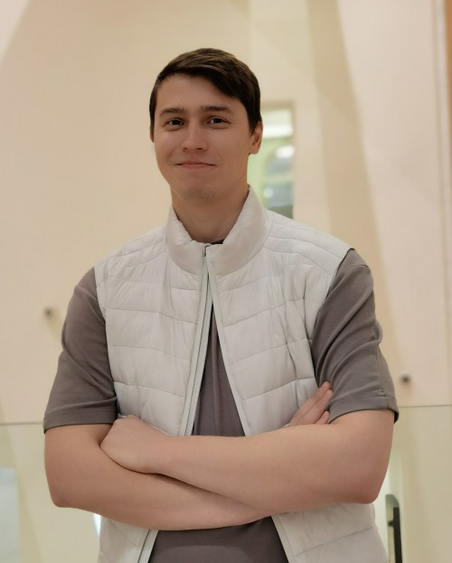

# Bukhryakov Oleg



*********

## Contact information:

* **Phone**: +996 228 034 393
* **E-mail**: oleg.b9113@gmail.com
* **Telegram**: @Fileofish13
* **Discord**: @Fileofish


## About Me:

I am 32 years old and work as an equipment procurement specialist for an oil company. Currently looking for inspiration in front-end development. I have experience in developing this stage 0 course.

I consider my focus to be my strong point. If I see a problem that needs to be solved, I just solve it. With the help of this course, I want to master the profession of a front-end programmer and find a job outside the CIS countries.


## Skills:

* HTML
* CSS (low level preprocessor SCSS, BEM methodology)
* JavaScript (Fundamentals)
* Git (remote service GitHub)
* low level Webpack
* Windows OS, Linux(Kubuntu)
* Figma
* VSCode


## Code exanples:

### Base Conversion

```
function convert(input, source, target) {
  let result = 0;
  if (source.length === target.length) {
    if (source[0] === target[0]) {
      return input;
    } else if (source[0] !== target[0]) {
      if (target[0] === 'n') {
        if (input[0] === 'P') return 'CodeWars'
        if (input[0] === 'c') return 'puNyyRatr'
      }

      if (source[0] === 'a') {
        return input.toUpperCase();
      } else if (source[0] === 'A') {
        return input.toLowerCase();
      }
    }
  } else if (source.length === 2 && target.length === 8) {
    return String((parseInt(input, 2)).toString(target.length));
  } else if (source.length === 2 && target.length === 10) {
    return String(parseInt(input, 2));
  } else if (source.length === 2 && target.length === 16) {
    result = parseInt(input, 2);
    return result.toString(target.length);
  } else if (source.length === 2 && target.length >= 26) {
    let arrResult = [];
    let decInput, inputCheck, letterIndex;
    decInput = parseInt(input, 2);
    if (decInput < target.length) {
      return target[decInput];
    } else {
      do {
        inputCheck = Math.floor(decInput / target.length);
        letterIndex = (decInput - Math.floor(inputCheck) * target.length);
        arrResult.push(target[letterIndex]);
        decInput = inputCheck;
      } while (inputCheck !== 0)
      return arrResult.reverse().join('');
    }
  } else if (source.length === 10 && target.length >= 2 && target.length < 26) {
    return (+input).toString(target.length);
  } else if (source.length === 10 && target.length >= 26) {
    let arrResult = [];
    let decInput, inputCheck, letterIndex;
    decInput = input;
    if (decInput < target.length) {
      return target[decInput];
    } else {
      do {
        inputCheck = Math.floor(decInput / target.length);
        letterIndex = (decInput - Math.floor(inputCheck) * target.length);
        arrResult.push(target[letterIndex]);
        decInput = inputCheck;
      } while (inputCheck !== 0)
      return arrResult.reverse().join('');
    }
  } else if (source.length > 10 && target.length <= 16) {
    let arrTarget = [];
    arrTarget = input.split('').reverse();
    for (i = 0; i < input.length; i++) {
      result += (source.split('')).indexOf(arrTarget[i]) * Math.pow(source.length, i);
    }
    return result.toString(target.length);
  } else if (source.length > 10 && target.length >= 26) {
    let arrTarget = [];
    let arrResult = [];
    let decInput, inputCheck, letterIndex;
    arrTarget = input.split('').reverse();
    for (i = 0; i < input.length; i++) {
      result += (source.split('')).indexOf(arrTarget[i]) * Math.pow(source.length, i);
    }
    decInput = result;
    if (decInput < target.length) {
      return target[decInput];
    } else {
      do {
        inputCheck = Math.floor(decInput / target.length);
        letterIndex = (decInput - Math.floor(inputCheck) * target.length);
        arrResult.push(target[letterIndex]);
        decInput = inputCheck;
      } while (inputCheck !== 0)
      return arrResult.reverse().join('');
    }
  }
}
```


## Education:

* Tyumen State University of Architecture and Civil Engineering, Faculty of Engineering and Economics, City Cadastre
* RS School Stage 0


## Experience:

**[Stage 0 plants]**[https://rolling-scopes-school.github.io/fileofish-JSFEPRESCHOOL2022Q4/plants/]


## English

B2